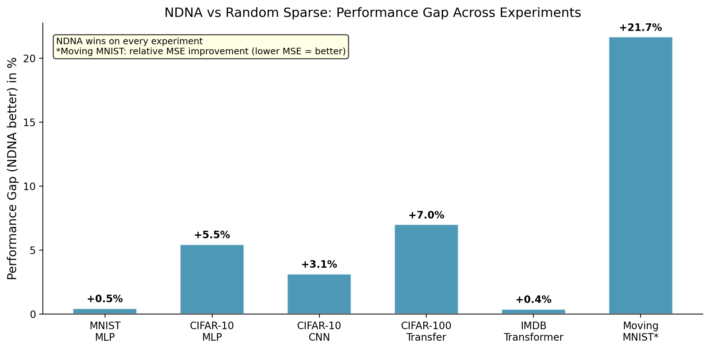

# Neural DNA (NDNA): A Compact Genome for Growing Network Architecture

A tiny learned genome (< 300 parameters) that grows neural network topology through developmental rules. Default disconnected, type-based compatibility, metabolic cost pressure. The genome discovers useful sparse connectivity that beats random wiring on every experiment, matches or exceeds dense baselines on most, and transfers across tasks without retraining.



## Key Results

| Experiment | Genome | Random Sparse | Dense Baseline | Genome vs Random |
|---|---|---|---|---|
| MNIST (MLP) | 97.54% | 97.09% | 98.33% | +0.45% |
| CIFAR-10 (MLP) | 57.14% | 51.68% | 54.32% | +5.46% |
| CIFAR-10 (CNN) | 88.93% | 85.78% | 89.80% | +3.15% |
| CIFAR-100 (Transfer) | 60.92% | 53.91% | 67.16% | +7.01% |
| IMDB (Transformer) | 85.05% | 84.66% | 84.57% | +0.39% |

226 to 258 genome parameters control up to 2.2M connections (8,384:1 compression).

## Requirements

Python >= 3.9. Tested on Apple M3 (MPS) and CPU. CUDA is also supported.

```bash
pip install -r requirements.txt
```

## Quick Start

```bash

# Train genome on MNIST
python3 run.py train

# Cross-task transfer (Fashion-MNIST -> MNIST)
python3 run.py transfer

# CIFAR-10 MLP
python3 run.py cifar10

# CIFAR-10 CNN
python3 run.py cnn

# Transfer CIFAR-10 genome to CIFAR-100
python3 run.py transfer100

# Genome transformer on IMDB
python3 run.py transformer

# Visualize a saved genome
python3 run.py visualize

# Print all saved results
python3 run.py results
```

## Project Structure

```
ndna/
├── run.py                   # Entry point for all experiments
├── genome/
│   ├── __init__.py          # Exports all models and baselines
│   ├── model.py             # Genome, GrownNetwork, GrownConvNetwork, GrownTransformer
│   ├── baselines.py         # Dense, random sparse, dense skip baselines
│   └── visualizer.py        # Topology visualization dashboard
├── experiments/
│   ├── train_mnist.py       # MNIST MLP experiment
│   ├── train_cifar10.py     # CIFAR-10 MLP experiment
│   ├── train_cifar10_cnn.py # CIFAR-10 CNN experiment
│   ├── transfer.py          # Fashion-MNIST -> MNIST transfer
│   ├── transfer_cifar100.py # CIFAR-10 -> CIFAR-100 transfer
│   └── rung3_transformer.py # IMDB transformer experiment
├── figures/                 # Paper figures (6 PNGs)
├── results/                 # Experiment outputs (JSON)
├── paper_ndna.md            # Full paper
├── paper_figures.py         # Figure generation script
├── requirements.txt
└── LICENSE
```

## Reproducing Experiments

Each experiment trains a genome alongside baselines (dense, random sparse, dense skip) for fair comparison. Results are saved to `results/` as JSON.

```bash
# Run all five experiments in sequence
python3 run.py train
python3 run.py cifar10
python3 run.py cnn
python3 run.py transfer100
python3 run.py transformer

# Check results
python3 run.py results
```

Experiments download datasets automatically to `data/` on first run.

## How It Works

1. **Genome** encodes cell type embeddings (8 types, 8 dimensions) and a compatibility matrix
2. **Growth**: for each potential connection, source and target type embeddings are compared via the compatibility matrix to produce a connection probability
3. **Binary mask**: probabilities are thresholded to produce hard 0/1 masks (straight-through estimator for gradient flow)
4. **Metabolic cost**: a sparsity loss penalizes total connection strength, forcing the genome to be selective
5. **Default disconnected**: compatibility is initialized negative, so the genome must actively grow every connection

The genome and network weights are trained jointly with standard backpropagation.

## Paper & Pre-trained Genomes

[](https://doi.org/10.5281/zenodo.19230474)

Full paper: [PDF](paper_ndna.pdf) | [Zenodo](https://doi.org/10.5281/zenodo.19230474)

Pre-trained genomes: [Hugging Face](https://huggingface.co/tejassuds/ndna-genome)

## Author

**Tejas Parthasarathi Sudarshan**
Independent Researcher, Chennai, India
tejas@fandesk.ai

## Citation

```bibtex
@article{sudarshan2026ndna,
  title={Neural DNA: A Compact Genome for Growing Network Architecture},
  author={Sudarshan, Tejas Parthasarathi},
  year={2026},
  doi={10.5281/zenodo.19230474}
}
```

## License

[MIT](LICENSE)
