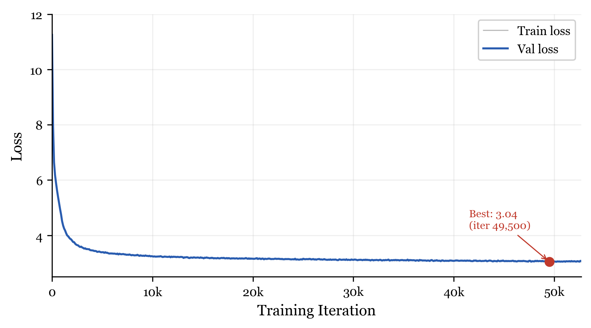
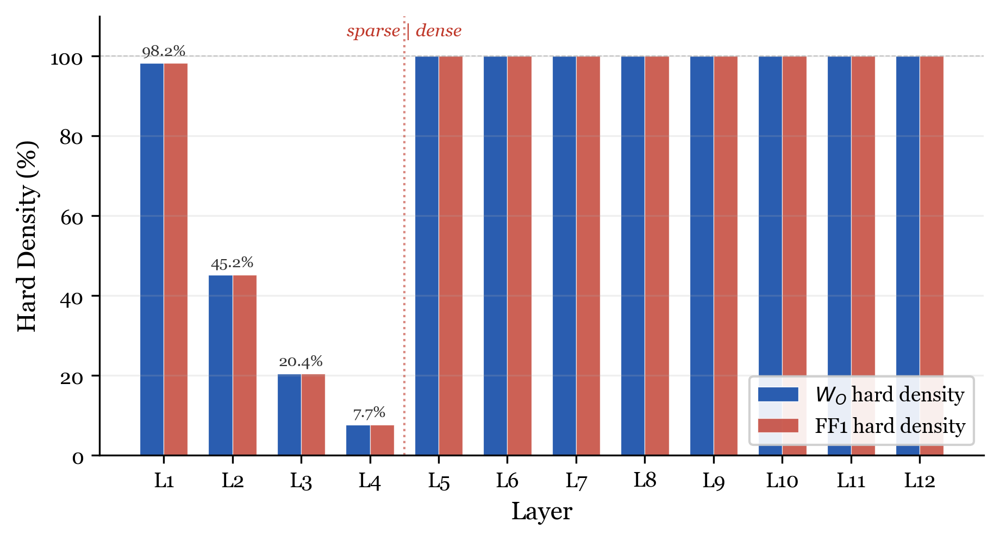
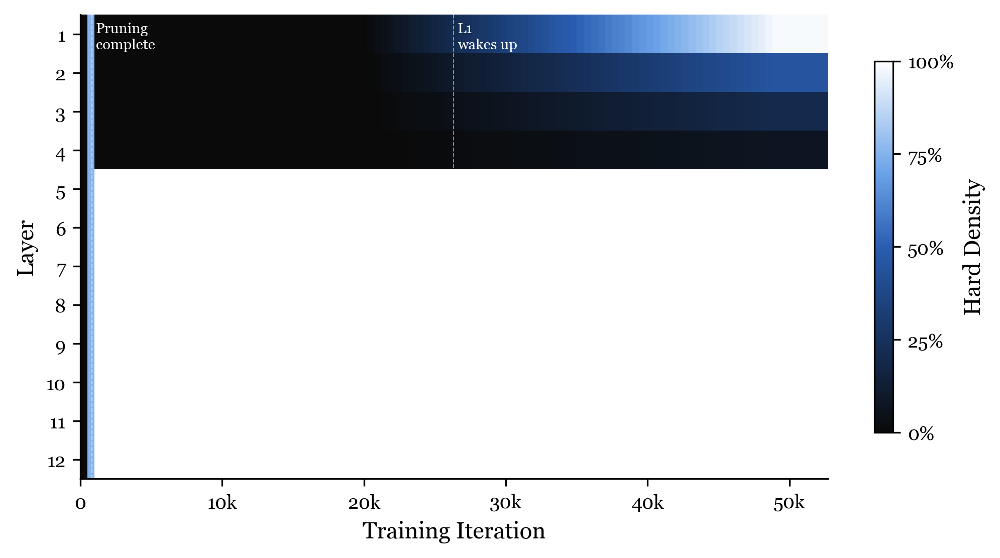

# NDNA GPT-2 Small

A GPT-2 Small (124M params) model where a **354-parameter genome** controls 35.4 million connections. The genome decides which attention output projections and feed-forward layers are connected, permanently disabling one-third of masked connections.

**99,970:1 compression ratio.** 354 learned parameters specify the wiring for 35.4M connections.

## How It Works

Neural DNA (NDNA) encodes network connectivity in a compact genome. Instead of storing one mask bit per connection, the genome stores a developmental program: 8 cell types with 8-dimensional affinity vectors and a compatibility matrix. Source and target type embeddings are compared to produce connection probabilities, which are thresholded to binary masks using a straight-through estimator. A metabolic cost term encourages sparsity, forcing the genome to be selective about which connections survive.

The genome and model weights are trained jointly from scratch on OpenWebText. Temperature annealing (1.0 to 10.0) smoothly transitions from soft to hard binary masks, locking the topology by the end of training.

**What the genome controls:**
- **Masked:** W_O (768x768, bias=False) and FF1 (3072x768) per layer = 2.95M connections/layer, 35.4M total across 12 layers
- **Not masked:** Q, K, V projections, FF2, LayerNorm, residual connections, LM head

The genome controls 28.4% of the model's total parameters. The remaining 71.6% train freely.

## Results



*Validation loss over 52,700 iterations. Best checkpoint: 3.04 at iteration 49,500.*

| Benchmark | NDNA GPT-2 | GPT-2 Small | Result |
|-----------|-----------|-------------|--------|
| WikiText-103 PPL | **36.0** | 37.5 | Beats GPT-2 |
| Penn Treebank PPL | **59.4** | 65.9 | Beats GPT-2 |
| LAMBADA PPL | **22.2** | 35.1 | Beats GPT-2 |
| LAMBADA ACC | 30.8% | 46.0% | 67% of GPT-2 |
| HellaSwag ACC | 28.7% | 31.2% | 92% of GPT-2 |
| CBT-CN ACC | 82.7% | 87.7% | 94% of GPT-2 |
| CBT-NE ACC | 74.5% | 83.4% | 89% of GPT-2 |
| enwiki8 BPB | 1.39 | 1.16 | |
| text8 BPC | 1.27 | 1.17 | |

Beats GPT-2 on 3 of 9 benchmarks (all perplexity metrics). The model produces better-calibrated probability distributions but less peaked predictions, leading to lower perplexity but lower exact-match accuracy.

### Supplementary Results (Language Model Evaluation Harness)

| Benchmark | Metric | NDNA GPT-2 |
|-----------|--------|-----------|
| ARC-Easy | ACC | 41.8% |
| PIQA | ACC | 60.1% |
| Winogrande | ACC | 52.8% |
| HellaSwag | ACC (norm) | 28.8% |

## Learned Topology



*Final per-layer hard density at temperature 10.0. Sharp boundary between sparse (L1-L4) and dense (L5-L12) zones.*

| Layer | 1 | 2 | 3 | 4 | 5-12 |
|-------|------|------|------|-----|------|
| Hard Density | 98.2% | 45.2% | 20.4% | 7.7% | 100% |

Layers 5-12 are fully connected. Layers 1-4 are progressively pruned in a strict monotonic gradient. The genome treats the network as having two distinct zones. One-third of all masked connections (11.8M out of 35.4M) are permanently disabled.

## Training Dynamics



*Per-layer hard density over training. Layer 1 is pruned at iter 800, then re-activates at iter 26,000.*

The genome goes through four distinct phases:

1. **Over-activation (iter 0-200):** Genome activates 83% of connections. Everything is on.
2. **Aggressive pruning (iter 200-800):** Layers 1-4 are pruned to 0% hard density. The genome discovers the model can function with only 8 of 12 layers carrying signal through masked projections.
3. **Stable learning (iter 800-25K):** Topology is fixed. Validation loss drops from 7.99 to 3.18. The network learns language with a sparse topology.
4. **Layer 1 resurrection (iter 25K-50K):** Layer 1 re-activates from 0% to 98.2% hard density. The genome changed its mind. Layers 2-4 remain pruned.

The layer 1 resurrection is the most unexpected finding. After 25,000 iterations of being completely disabled, the genome reverses its decision and reconnects layer 1. This is a discrete topological event, not a smooth interpolation.

## Usage

```python
import torch
from genome.model import Genome, GrownGPT2

# Load checkpoint
ckpt = torch.load("genome_ckpt.pt", map_location="cpu")

# Initialize
genome = Genome(n_types=8, type_dim=8, n_bands=14)
model = GrownGPT2(genome)

# Load weights (strip torch.compile prefix)
model_state = {k.replace("_orig_mod.", ""): v for k, v in ckpt["model"].items()}
genome_state = {k.replace("_orig_mod.", ""): v for k, v in ckpt["genome"].items()}
genome.load_state_dict(genome_state)
model.load_state_dict(model_state, strict=False)

# Enable hard binary masks for evaluation
model.hard_masks = True
model.eval()
```

## Training Details

- **Dataset:** OpenWebText (open reproduction of WebText)
- **Hardware:** Single NVIDIA A100 80GB GPU
- **Iterations:** 52,700 (best checkpoint at 49,500)
- **Tokens:** 25.9 billion (491,520 tokens/iter = 12 seqs x 1024 tokens x 40 grad accum)
- **Weight optimizer:** AdamW (lr=6e-4, beta1=0.9, beta2=0.95, cosine decay, warmup 2000, weight decay 0.1)
- **Genome optimizer:** Adam (lr=0.01, constant, no decay)
- **Temperature:** 1.0 to 10.0 over 50K iterations (linear anneal)
- **Sparsity weight:** 0.005
- **Precision:** bfloat16 with torch.compile
- **Gradient clipping:** 1.0
- **Random seed:** 42

### Genome Configuration

| Component | Shape | Parameters |
|-----------|-------|-----------|
| Affinity matrix A | 8x8 | 64 |
| Compatibility matrix C | 8x8 | 64 |
| Connection scale | scalar | 1 |
| Depth penalty | scalar | 1 |
| Band type base | 14x8 | 112 |
| Band type gradient | 14x8 | 112 |
| **Total** | | **354** |

8 cell types, 8-dimensional affinity vectors, 14 bands (1 embedding + 12 transformer layers + 1 output).

### Compression Ratio Progression

| Experiment | Genome Params | Connections | Compression |
|------------|--------------|-------------|-------------|
| MNIST MLP | 226 | 174K | 770:1 |
| CIFAR-10 MLP | 226 | 1.7M | 7,553:1 |
| IMDB Transformer | 258 | 2.2M | 8,384:1 |
| **GPT-2 Small** | **354** | **35.4M** | **99,970:1** |

## Links

- **Paper 1:** [Neural DNA: A Compact Genome for Growing Network Architecture](https://doi.org/10.5281/zenodo.19248389)
- **Paper 2:** [Scaling Neural DNA to GPT-2: 354 Parameters Wire a Language Model](https://zenodo.org/records/19390927)
- **Code:** [github.com/tejassudsfp/ndna](https://github.com/tejassudsfp/ndna)
- **Interactive Visualization:** [ndna.tejassuds.com](https://ndna.tejassuds.com)

## Author

Tejas Parthasarathi Sudarshan
Independent Researcher, Chennai, India
[tejas@fandesk.ai](mailto:tejas@fandesk.ai) | [tejassuds.com](https://tejassuds.com) | [LinkedIn](https://www.linkedin.com/in/tejassuds/)

## Citation

```bibtex
@article{sudarshan2026ndna,
  title={Neural DNA: A Compact Genome for Growing Network Architecture},
  author={Sudarshan, Tejas Parthasarathi},
  year={2026},
  doi={10.5281/zenodo.19248389}
}

@article{sudarshan2026ndna_gpt2,
  title={Scaling Neural DNA to GPT-2: 354 Parameters Wire a Language Model},
  author={Sudarshan, Tejas Parthasarathi},
  year={2026},
  doi={10.5281/zenodo.19390927}
}
```
