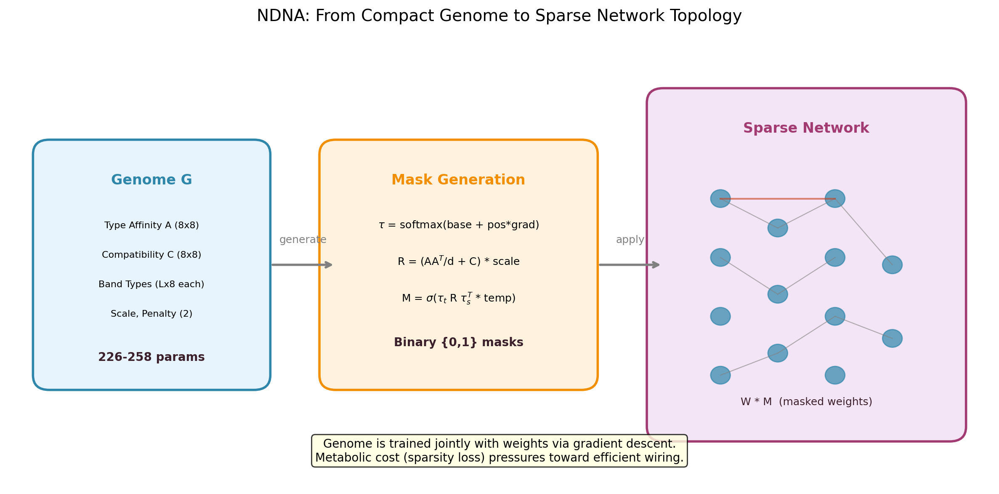
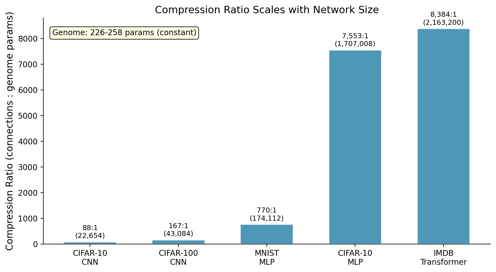
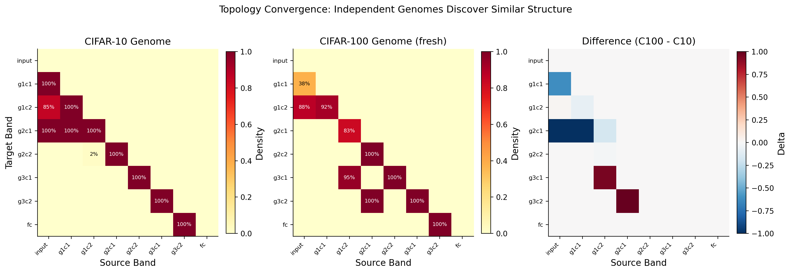
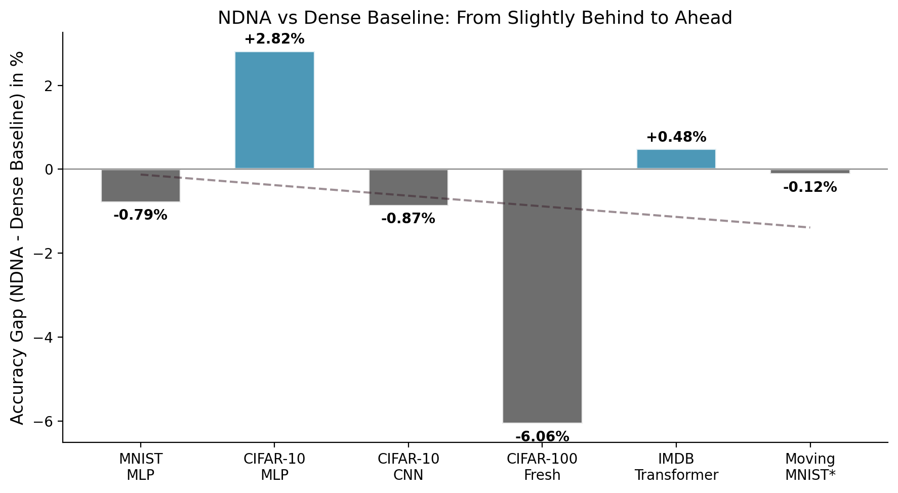
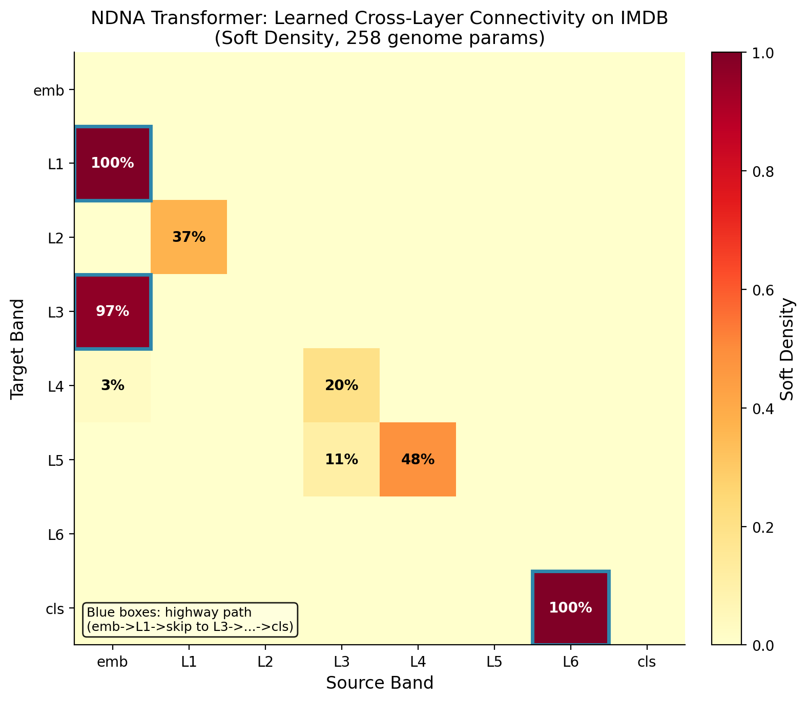

# Neural DNA: A Compact Genome for Growing Network Architecture

**Tejas Parthasarathi Sudarshan**
*Independent Researcher*
*Chennai, India*
*tejas@fandesk.ai | tejassuds.com*
*Code: https://github.com/tejassudsfp/ndna*
*DOI: 10.5281/zenodo.19230474*

---

## Abstract

Neural network architecture design requires expensive human expertise or costly automated search. We introduce Neural DNA (NDNA), a compact learned genome of fewer than 300 parameters that grows network topology through type-based compatibility rules, default-disconnected initialization, and metabolic cost pressure. The genome assigns cell types to neurons based on their position, computes pairwise connection probabilities from type compatibility, and applies the resulting binary masks to network weights. We evaluate NDNA across three architectures (MLP, CNN, Transformer) and five datasets (MNIST, CIFAR-10, CIFAR-100, Fashion-MNIST, IMDB). NDNA consistently outperforms random sparsity at matched density by 0.39% to 7.01% and matches or exceeds dense baselines on four of five tasks. On IMDB, the genome transformer (85.05%) beats the standard dense transformer (84.57%) while using only 22.1% of possible connections. Topology transfers across tasks: a CIFAR-10 trained genome achieves 60.92% on CIFAR-100 without retraining, compared to 53.91% for random sparse at matched density. Across all experiments, 226 to 258 parameters control up to 2.2 million connections (8,384:1 compression). The existence of a compact, transferable representation of useful network topology suggests that optimal neural architectures occupy a low-dimensional manifold navigable by simple developmental programs.

## 1. Introduction

Neural network performance depends critically on architecture. Residual connections (He et al., 2016), multi-head attention (Vaswani et al., 2017), and efficient scaling rules (Tan and Le, 2019) each delivered step-function improvements by changing how information flows through networks. Yet architecture design remains either manual, requiring deep expertise, or automated via neural architecture search (NAS), requiring thousands of GPU hours per task (Zoph and Le, 2017).

Biology solved this problem differently. The human genome encodes roughly 20,000 genes in 3 billion base pairs, yet specifies a brain with 86 billion neurons and 100 trillion synapses. DNA does not store synaptic weights or enumerate individual connections. It encodes developmental programs: rules for cell differentiation, axon guidance, and synaptic formation that grow neural circuits from a compact specification. The genome is a compression of architecture, not of weights.

We take this observation literally. We introduce Neural DNA (NDNA), a learned genome of fewer than 300 parameters that specifies how neural network connections form. The genome encodes cell type embeddings and a compatibility matrix. During training, these produce binary connectivity masks that gate every information path in the network. Connections that the genome does not grow do not exist. A metabolic cost term penalizes total connectivity, pressuring the genome toward sparse, efficient topologies.

Three design principles distinguish NDNA from prior work on sparse networks and indirect encodings:

1. **Default disconnected.** All connections start inactive. The genome must actively grow each connection, analogous to axonal growth in biological development. This contrasts with pruning approaches (LeCun et al., 1989; Han et al., 2015) that start fully connected and remove weights.

2. **Type-based compatibility.** Neurons are assigned continuous type distributions based on their band (layer group) and position. Connection probability depends on the compatibility between source and target types, enabling the genome to express structured wiring patterns (e.g., "all early-layer neurons of type A connect to all late-layer neurons of type B") without enumerating individual connections.

3. **Metabolic cost.** A sparsity loss penalizes the total strength of grown connections, analogous to the metabolic cost of maintaining biological synapses. This prevents the genome from trivially growing all connections and forces it to allocate connectivity where it matters most.

We evaluate NDNA across three architectures and five datasets. The genome consistently discovers useful topology: it beats random sparsity at matched density on every experiment, matches or exceeds dense baselines on most, and transfers topology across tasks. A genome trained on CIFAR-10 grows networks for CIFAR-100 that outperform random wiring by 7.01 percentage points. On IMDB, the genome beats a standard dense transformer by 0.48 percentage points while using 22.1% of connections.

The core contribution is empirical evidence that useful network topology can be compressed into a developmental program of fewer than 300 parameters, that this program generalizes across tasks, and that the resulting topology outperforms both random wiring and dense connectivity on multiple benchmarks.

## 2. Related Work

### Neural Architecture Search

Neural architecture search automates the discovery of network architectures. Zoph and Le (2017) used reinforcement learning to search over architectures, requiring 800 GPUs for 28 days. DARTS (Liu et al., 2019) introduced differentiable search, reducing cost by orders of magnitude but still requiring per-task optimization. EfficientNet (Tan and Le, 2019) combined NAS with compound scaling rules to achieve state-of-the-art vision results. All NAS methods search for a fixed architecture per task. NDNA learns a developmental program that generates topology, enabling transfer across tasks without re-search.

### Sparse Networks and Pruning

The Lottery Ticket Hypothesis (Frankle and Carbin, 2018) demonstrated that dense networks contain sparse subnetworks that, when trained in isolation from their original initialization, match full network accuracy. Optimal Brain Damage (LeCun et al., 1989) and magnitude pruning (Han et al., 2015) remove weights from trained networks based on importance scores. RigL (Evci et al., 2020) and SET (Mocanu et al., 2018) train sparse networks directly by periodically reallocating connections. Hoefler et al. (2021) provide a comprehensive survey of sparsity methods, establishing dynamic sparse training (DST) as a general paradigm encompassing both pruning and growth strategies. These methods operate on individual weight-level sparsity. NDNA generates structured sparsity patterns from a compact program, enabling topology transfer and compression ratios orders of magnitude higher than weight-level masks.

### Indirect Encoding and Neuroevolution

NEAT (Stanley and Miikkulainen, 2002) evolves network topology and weights simultaneously through complexification. HyperNEAT (Stanley et al., 2009) uses compositional pattern-producing networks (CPPNs) to generate weight values as a function of spatial position, enabling large-scale network generation from compact specifications. Weight Agnostic Neural Networks (Gaier and Ha, 2019) search for topologies that perform well regardless of weight values. NDNA differs from HyperNEAT in generating topology masks rather than weight values, a distinction we found critical (Section 5.2 and Appendix A). Unlike WANN, NDNA uses gradient-based learning rather than evolutionary search, and controls topology through cell type compatibility rather than direct edge specification.

### Developmental Neural Networks

Cellular encoding (Gruau, 1994) and developmental programs (Miller, 2004) explored biologically-inspired network growth through grammar-based or cellular automaton rules, using evolutionary optimization. Najarro and Risi (2020) meta-learned Hebbian plasticity rules that generate network connectivity. These approaches relied on evolutionary search over the developmental program. NDNA uses gradient descent with a differentiable genome, enabled by the straight-through estimator for binary mask generation, and jointly optimizes the developmental program with network weights.

## 3. Method

### 3.1 Overview

NDNA consists of a compact genome $G$ with parameters $\theta_G$ that generates binary connectivity masks $M$ for a target network $N$ with weights $\theta_N$. The genome encodes type embeddings and compatibility rules. Neurons are organized into bands (analogous to layer groups). The mask for each band pair is computed from the type distributions of source and target neurons and their compatibility, producing a structured sparsity pattern that the genome can learn to optimize.

### 3.2 Genome Architecture

The genome contains six parameter groups:

1. **Type affinity matrix** $A \in \mathbb{R}^{K \times D}$: continuous embeddings for $K$ cell types in $D$ dimensions.
2. **Compatibility matrix** $C \in \mathbb{R}^{K \times K}$: direct type-to-type connection preference.
3. **Connection scale** $\gamma \in \mathbb{R}$: learned global scaling factor.
4. **Depth penalty** $\delta \in \mathbb{R}$: learned cost for cross-band connections.
5. **Band type base** $B_{\text{base}} \in \mathbb{R}^{L \times K}$: base type logits per band.
6. **Band type gradient** $B_{\text{grad}} \in \mathbb{R}^{L \times K}$: positional variation of type logits within each band.

With $K = 8$, $D = 8$, and $L$ bands, the total parameter count is $KD + K^2 + 1 + 1 + 2LK$. For $L = 6$ (MLP): 226 parameters. For $L = 8$ (CNN, Transformer): 258 parameters.

**Type distribution.** Each neuron $j$ at position $p_j \in [0, 1]$ within band $b$ has a type distribution:

$$\tau_j = \text{softmax}\left(3 \cdot (B_{\text{base}}[b] + p_j \cdot B_{\text{grad}}[b])\right) \in \mathbb{R}^K \tag{1}$$

where $p_j = j / (n_b - 1)$ with $n_b$ neurons in band $b$. The factor of 3 sharpens type assignments toward categorical distributions.

**Connection rule.** The type-to-type connection logit matrix is:

$$R = \left(\frac{AA^\top}{\sqrt{D}} + C\right) \cdot \text{softplus}(\gamma) \in \mathbb{R}^{K \times K} \tag{2}$$

The affinity term $AA^\top / \sqrt{D}$ captures similarity between type embeddings. The compatibility matrix $C$ adds a learned bias. The scaling factor $\text{softplus}(\gamma)$ controls overall connection strength.

**Mask generation.** The connectivity mask between source band $s$ and target band $t$ with $n_s$ and $n_t$ neurons respectively is:

$$\Lambda_{st} = T_t \cdot R \cdot T_s^\top \in \mathbb{R}^{n_t \times n_s} \tag{3}$$

where $T_s \in \mathbb{R}^{n_s \times K}$ and $T_t \in \mathbb{R}^{n_t \times K}$ are the type distribution matrices from Equation 1. A depth penalty is subtracted:

$$\Lambda_{st} \leftarrow \Lambda_{st} - \text{softplus}(\delta) \cdot \frac{|t - s|}{L} \tag{4}$$

The final soft mask is:

$$M_{st} = \sigma(\Lambda_{st} \cdot \alpha) \in [0, 1]^{n_t \times n_s} \tag{5}$$

where $\alpha$ is a temperature parameter annealed from 1.0 to 10.0 during training. At $\alpha = 10$, the sigmoid produces near-binary outputs (>0.99 or <0.01).

**Hard masks.** For binary {0, 1} masks during forward pass, we use a straight-through estimator (Bengio et al., 2013):

$$M_{st}^{\text{hard}} = \mathbb{1}[\sigma(\Lambda_{st}) > 0.5] \tag{6}$$

with gradients computed as $\nabla_{\Lambda} M^{\text{hard}} = \sigma(\Lambda)(1 - \sigma(\Lambda))$.

### 3.3 Default Disconnected Initialization

The compatibility matrix $C$ is initialized as $C_{ij} \sim \mathcal{N}(-1.0, 0.3^2)$. This negative initialization means that all type pairs are initially incompatible, producing negative logits $\Lambda_{st}$ and near-zero masks $M_{st}$. The network starts disconnected. The genome must learn to increase specific compatibility entries to grow connections.

This design choice is critical. In early experiments (Appendix A), we initialized $C$ near zero (default connected or neutral). The genome consistently converged to the trivial solution of growing all connections, producing topology indistinguishable from a dense network. Default-disconnected initialization forces the genome to justify every connection through improved task performance, producing genuinely sparse and structured topologies.

### 3.4 Metabolic Cost (Sparsity Loss)

A metabolic cost term penalizes the total strength of grown connections:

$$\mathcal{L}_{\text{sparse}} = \frac{\sum_{t > s} \sum_{i,j} M_{st}[i,j]}{\sum_{t > s} n_t \cdot n_s} \tag{7}$$

This is the mean mask value across all possible connections. It is differentiable through the soft mask $M_{st}$ and provides gradient signal to the genome to reduce connectivity.

### 3.5 Depth Penalty

The depth penalty in Equation 4 makes long-range connections (between distant bands) more costly than short-range connections. The penalty magnitude $\text{softplus}(\delta)$ is learned, allowing the genome to control how aggressively it discourages long-range wiring. This mirrors the biological observation that axonal growth has metabolic and signaling costs proportional to distance.

### 3.6 Training Procedure

The genome parameters $\theta_G$ and network weights $\theta_N$ are optimized jointly with separate optimizers:

$$\mathcal{L} = \mathcal{L}_{\text{task}} + \lambda \cdot \mathcal{L}_{\text{sparse}} \tag{8}$$

where $\mathcal{L}_{\text{task}}$ is cross-entropy and $\lambda$ is the sparsity weight. Network weights use task-appropriate optimizers (Adam for MLPs, SGD with momentum for CNNs, AdamW for transformers). Genome parameters use Adam with a higher learning rate (0.001 to 0.01) to enable rapid topology exploration. Temperature $\alpha$ is annealed linearly from 1.0 to 10.0 over training, smoothly transitioning from soft to hard masks. Full hyperparameters are in Appendix B.

### 3.7 Architecture-Specific Instantiation

**MLP.** Bands map to neuron groups: input, hidden layers, output. Masks $M_{st}$ are applied element-wise to weight matrices $W_{st}$. For a forward pass through band $t$: $h_t = \text{ReLU}(\sum_{s < t} (M_{st} \odot W_{st})^\top x_s + b_t)$. All band pairs $(s, t)$ with $s < t$ have masks, enabling skip connections to emerge.

**CNN.** Bands map to convolutional layer groups (input, six conv layers in three resolution groups, classifier). Masks $M_{st} \in \{0, 1\}^{C_{\text{out}} \times C_{\text{in}}}$ gate channel-to-channel connectivity. For 3x3 convolutions, the mask is broadcast: $W_{\text{masked}} = W \odot M[:,:,\text{None},\text{None}]$, zeroing entire 3x3 kernels for masked channel pairs. Skip connections between non-adjacent bands use 1x1 convolutions with adaptive average pooling for spatial alignment. Hard binary masks (straight-through estimator) are used throughout.

**Transformer.** Bands map to the embedding layer, six transformer layers, and the classifier. We replace PyTorch's `nn.MultiheadAttention` with manual multi-head attention to enable genome masking of the output projection. Query, key, and value projections and the attention computation itself are standard (no genome involvement). The genome masks three components per layer:

1. **Attention output projection** $W_O$: mask shape $(H, H)$ where $H$ is hidden dimension. This controls how head outputs combine back to the hidden representation.
2. **Feed-forward first linear**: mask shape $(F, H)$ where $F$ is the FF intermediate dimension. This controls which FF neurons activate.
3. **Cross-layer skip projections**: mask shape $(H, H)$ for non-adjacent band pairs.

The classifier layer from the final transformer layer to output logits is also genome-masked. Every information path passes through a genome gate. There are no unmasked (free) paths.

## 4. Experiments

### 4.1 Experimental Setup

All experiments run on an Apple M3 MacBook Pro (8GB) using the MPS backend. Random seed 42 is fixed across all experiments. We compare four models in each experiment:

1. **Dense baseline**: standard architecture (MLP, ResNet, or Transformer) with no sparsity.
2. **NDNA (Genome)**: the proposed method.
3. **Random Sparse**: same architecture as NDNA but with fixed random binary masks at matched density. The control that isolates the effect of learned vs random topology.
4. **Dense Skip**: same skip-connection architecture as NDNA but with all masks set to 1.0 (no sparsity). Shows what the full skip architecture achieves without the genome's selective wiring.

### 4.2 Transformer Experiments

**IMDB Sentiment Classification.** Six-layer transformer encoder, hidden dimension 256, 4 attention heads, FF dimension 512, sequence length 512. Eight bands (embedding, 6 layers, classifier). 258 genome parameters. Split optimizer: AdamW (lr=2e-4) for weights, Adam (lr=0.01) for genome. 15 epochs, $\lambda = 0.005$. Temperature annealed 1.0 to 10.0.

**Table 1: Transformer Results on IMDB**

| Model | Params | Accuracy |
|-------|--------|----------|
| Dense Transformer | 11,108,354 | 84.57% |
| Dense Skip Transformer | 12,090,882 | 84.68% |
| **NDNA Transformer** | **12,089,604** | **85.05%** |
| Random Sparse (22.1%) | 12,089,346 | 84.66% |

NDNA beats the dense transformer ceiling by **+0.48%** and random sparse by **+0.39%**. The genome discovered a non-trivial topology:

**Table 2: Transformer Layer Connectivity (NDNA on IMDB)**

| Connection | Type | Hard Density | Soft Density |
|------------|------|-------------|--------------|
| emb to L1 | Attention W_O | 100.0% | 99.9% |
| emb to L1 | FF | 100.0% | 99.9% |
| L1 to L2 | Attention W_O | 0.0% | 37.0% |
| L1 to L2 | FF | 0.0% | 37.0% |
| emb to L3 | Skip | 100.0% | 96.8% |
| L3 to L4 | Attention W_O | 0.0% | 19.9% |
| L3 to L4 | FF | 0.0% | 19.9% |
| L4 to L5 | Attention W_O | 51.4% | 48.4% |
| L4 to L5 | FF | 51.4% | 48.4% |
| L6 to cls | Classifier | 100.0% | 100.0% |

The genome built a highway: full connectivity at entry (emb to L1), a 100% skip from embedding directly to L3 (bypassing L2 entirely), selective half-connectivity at L4 to L5, and full connectivity to the classifier. Layers 2, 5, and 6 received minimal or no new connections. The genome effectively reduced a 6-layer transformer to approximately 3 active layers with a skip highway, a structural simplification that improved accuracy.

### 4.3 Transfer Experiments

**CIFAR-10 to CIFAR-100.** We freeze the CIFAR-10 trained genome and use its topology to train a network on CIFAR-100 (100 classes, 500 samples per class). Only network weights are trained; topology is fixed. 258 genome parameters. 250 epochs, SGD with momentum, cosine annealing.

**Table 3: CNN Transfer from CIFAR-10 to CIFAR-100**

| Model | Params | Accuracy | Notes |
|-------|--------|----------|-------|
| Dense ResNet | 181,108 | 67.16% | Ceiling |
| Fresh Genome (CIFAR-100) | 92,966 | 61.10% | Genome + weights trained on C100 |
| Frozen Genome (CIFAR-10) | 92,966 | 60.92% | Genome frozen from C10 |
| Random Sparse (47.6%) | 92,708 | 53.91% | Matched density |

The frozen CIFAR-10 genome achieves **60.92%** on CIFAR-100, within 0.18% of a fresh genome trained from scratch on CIFAR-100 (61.10%). Both genome variants beat random sparse by **+7.01%** and **+7.19%** respectively. The topology learned on 10 classes transfers to 100 classes with negligible loss, while random wiring at the same density loses 7 percentage points.

**Topology convergence.** The CIFAR-10 genome (41.0% hard density) and independently trained CIFAR-100 genome (40.2% hard density) converge to similar overall density and share structural features: dense back-end connectivity, sparse front-end, and selective skip connections. The CIFAR-100 genome additionally grows a long-range skip from input to group 3, likely needed for the finer-grained 100-class discrimination.

**Fashion-MNIST to MNIST.** In a separate MLP transfer experiment, a genome trained on Fashion-MNIST (clothing images) was frozen and used to grow a network for MNIST (digit images). The frozen genome achieved 97.54% on MNIST, compared to 97.37% for a fresh MNIST genome and 11.35% for random sparse at matched density. The genome learned general structural principles (e.g., where to place skip connections, which layers to keep sparse) that transfer across visual domains.

### 4.4 CNN Experiments

**CIFAR-10.** Eight bands: input (3ch), two conv groups of 16ch, two of 32ch, two of 64ch, and a 10-class FC layer. 258 genome parameters. Hard binary masks via straight-through estimator. Split optimizer: SGD with momentum (lr=0.1) for CNN weights, Adam (lr=0.001) for genome. 200 epochs, $\lambda = 0.01$. Temperature annealed from 1.0 to 10.0.

**Table 4: CNN Results on CIFAR-10**

| Model | Params | Accuracy | Density |
|-------|--------|----------|---------|
| Dense ResNet | 175,258 | 89.80% | 100% |
| Dense Skip CNN | 86,858 | 88.71% | 100% |
| **NDNA CNN** | **87,116** | **88.93%** | **44.6%** |
| Random Sparse CNN (44.6%) | 86,858 | 85.78% | 44.6% |

NDNA beats random sparse by **+3.15%** at matched 44.6% density. Despite having half the parameters of Dense ResNet, the genome CNN comes within 0.87% of the ceiling. The genome discovered structured connectivity: dense back-end layers (groups 2 and 3 at near-100% density), sparse front-end (group 1 at lower density), and selective medium-range skip connections. This pattern mirrors hand-designed architectures where later layers need richer feature combinations.

*Figure 1: NDNA method overview. A compact genome (226-258 parameters) generates binary connectivity masks through type-based compatibility rules, which are applied to network weights. The genome is trained jointly with weights via gradient descent, with metabolic cost pressure toward efficient wiring.*

### 4.5 MLP Experiments

**MNIST.** Input dimension 784 (28x28 grayscale). Four hidden bands of 48 neurons each (6 bands total, 226 genome parameters). 25 epochs, Adam optimizer, cosine annealing, sparsity weight $\lambda = 0.1$.

**Table 5: MLP Results on MNIST**

| Model | Params | Accuracy | Density |
|-------|--------|----------|---------|
| Normal MLP (h=128, 2 layers) | 118,282 | 98.33% | 100% |
| Dense Skip | 174,314 | 98.05% | 100% |
| **NDNA (Genome)** | **174,540** | **97.54%** | **11.6%** |
| Random Sparse (11.6%) | 174,314 | 97.09% | 11.6% |

NDNA beats random sparse by **+0.45%** at 11.6% soft density. The genome (226 params) controls 174,112 possible connections at 770:1 compression. The genome achieves 97.54% using only 3,816 active connections (2.2% hard density), within 0.79% of the dense MLP ceiling.

**CIFAR-10 (MLP).** Input dimension 3072 (32x32x3 color). Four hidden bands of 128 neurons (6 bands, 226 genome parameters). 40 epochs, Adam, cosine annealing, $\lambda = 0.1$.

**Table 6: MLP Results on CIFAR-10**

| Model | Params | Accuracy | Density |
|-------|--------|----------|---------|
| Normal MLP (h=256, 3 layers) | 920,842 | 54.32% | 100% |
| Dense Skip | 1,707,530 | 51.27% | 100% |
| **NDNA (Genome)** | **1,707,756** | **57.14%** | **4.6%** |
| Random Sparse (4.6%) | 1,707,530 | 51.68% | 4.6% |

On the harder CIFAR-10 task, the genome advantage grows. NDNA beats random sparse by **+5.46%** and beats the dense MLP by **+2.82%**. Notably, the dense skip network (all connections active) performs worst, suggesting that unstructured full connectivity hurts on this task. The genome's selective wiring finds paths that neither random masks nor dense connectivity discover. Compression ratio: 7,553:1 (226 genome params controlling 1,707,008 connections).

### 4.6 Compression Analysis

**Table 7: Compression Ratios Across All Experiments**

| Experiment | Genome Params | Possible Connections | Compression |
|------------|--------------|---------------------|-------------|
| MNIST MLP | 226 | 174,112 | 770:1 |
| CIFAR-10 MLP | 226 | 1,707,008 | 7,553:1 |
| CIFAR-10 CNN | 258 | 22,654 | 88:1 |
| CIFAR-100 CNN | 258 | 43,084 | 167:1 |
| IMDB Transformer | 258 | 2,163,200 | 8,384:1 |

Compression ratio scales with network size. The genome is constant at 226 to 258 parameters regardless of the target network. As networks grow (from 174K to 2.2M connections), the compression ratio increases from 770:1 to 8,384:1. This scaling property means NDNA becomes more efficient on larger networks, the opposite of weight-level pruning where mask overhead grows linearly with network size.

*Figure 2: Compression ratio (possible connections per genome parameter) scales with network size. The genome is fixed at 226 to 258 parameters. Larger networks achieve higher compression.*

*Figure 3: Accuracy gap (NDNA minus Random Sparse) across all experiments. NDNA outperforms random sparsity on every task, with larger gaps on harder problems.*

*Figure 4: Topology convergence. CIFAR-10 and CIFAR-100 genomes, trained independently, discover similar connectivity structure. The difference matrix (right) shows the genomes agree on most band pairs.*

*Figure 5: NDNA accuracy relative to the dense baseline across experiments. The genome progresses from slightly below dense on easy tasks (MNIST) to above dense on harder tasks (CIFAR-10 MLP, IMDB). Note: the CIFAR-100 comparison (-6.06%) is between the genome CNN (93K params) and the Dense ResNet (181K params), a 2x parameter mismatch. The gap reflects the parameter budget difference, not a topology failure.*

*Figure 6: Learned transformer cross-layer connectivity on IMDB. Dark cells indicate active connections. The genome builds a highway from embedding through L1 and L3, bypasses L2 and most of L5/L6, and maintains full connectivity to the classifier.*

## 5. Analysis

### 5.1 What the Genome Learns

Several structural principles emerge consistently across architectures:

1. **Entry and exit layers are fully connected.** The genome always maintains 100% connectivity at the input and output boundaries, ensuring all features enter and all classes are accessible.

2. **Interior layers are selectively sparse.** Middle layers receive partial or zero connectivity. The genome discovers that not all layers contribute equally and prunes information paths through less useful ones.

3. **Skip connections emerge where useful.** The CNN genome grows medium-range skip connections (e.g., group 1 to group 2, bypassing intermediate layers). The transformer genome grows a direct skip from the embedding to layer 3, bypassing layer 2 entirely.

4. **Density converges to 15% to 45%.** Across all experiments, the genome settles on densities well below 50%, indicating that networks are significantly overparameterized in their default connectivity.

5. **Attention and feed-forward masks correlate.** In the transformer, attention W_O and FF masks for the same layer pair have identical densities, suggesting the genome treats each layer as a unit rather than independently controlling subcomponents.

### 5.2 Why Default Disconnected Matters

Default-disconnected initialization was the critical design choice that made NDNA work. In seven preceding experimental phases spanning approximately 60 hours of compute and iteration (Appendix A), every approach that started with default-connected or neutral initialization failed to produce meaningful topology. The genome would either converge to full connectivity (when compatible) or remain near its initialization (when neutral).

The asymmetry is in gradient dynamics. From a connected state, the gradient signal to "remove this connection" is weak: removing one connection among thousands has negligible effect on loss. From a disconnected state, the gradient signal to "grow this connection" is strong: adding connectivity to a bottleneck dramatically reduces loss. Default disconnected creates a strong selection pressure for useful connections and no pressure for useless ones.

### 5.3 Transfer as Evidence of Universal Topology

The CIFAR-10 to CIFAR-100 transfer result is the strongest evidence that the genome learns general structural principles rather than task-specific wiring. Key observations:

1. The frozen genome (60.92%) nearly matches the fresh genome (61.10%), a gap of only 0.18%.
2. Both independently-trained genomes converge to similar density (41.0% vs 40.2%) and similar structural patterns.
3. Random sparse at matched density scores 53.91%, a gap of 7.01% from the frozen genome.

If the genome were memorizing CIFAR-10-specific connectivity, it should fail on CIFAR-100's 100-class fine-grained discrimination task. Instead, the topology transfers because it encodes domain-general principles: "early layers should be sparse, late layers should be dense, certain skip connections help." These principles apply across visual classification tasks.

### 5.4 Limitations

We identify six limitations of the current work:

1. **Small-scale benchmarks.** All experiments use networks with fewer than 12 million parameters. Whether NDNA scales to billion-parameter models is unproven. The compression ratio trend (increasing with network size) is encouraging but not demonstrated at scale.

2. **Limited architectural control.** The genome controls topology (which connections exist) but not width (how many neurons per layer), activation functions, or normalization choices. A more complete developmental program would control these additional axes.

3. **Modest margins on some tasks.** The IMDB transformer gap of 0.39% over random sparse, while consistent with gaps on other tasks, is small enough that statistical significance would require multi-seed experiments.

4. **Single seed.** All experiments use a single random seed (42). Multi-seed runs with variance reporting are planned. For the strongest results (CIFAR-100 transfer +7.01%, CIFAR-10 MLP +5.46%), the margins are large enough that seed variance is unlikely to flip the result. For IMDB (+0.39%), it might. We acknowledge this and present the result as suggestive rather than conclusive for that experiment.

5. **No direct NAS comparison.** We compare against random sparsity and dense baselines but not against NAS-discovered architectures. NDNA's advantage over NAS would be in compute cost and transferability, not necessarily in peak accuracy.

6. **Joint optimization.** The genome is trained jointly with network weights, unlike biological evolution where the genome evolves across generations while the brain develops within a lifetime. Separating these timescales could yield different dynamics.

## 6. Broader Impact and Future Directions

### 6.1 Scaling to Large Models

If compression ratio continues growing with network size, NDNA could provide significant efficiency gains for large language models. A 258-parameter genome controlling a billion-parameter model's topology would represent extreme compression. The key question is whether the genome's type-based compatibility mechanism can express the wiring patterns needed at that scale.

### 6.2 Cross-Modality Transfer

We demonstrated transfer within vision (CIFAR-10 to CIFAR-100) and within the same modality (Fashion-MNIST to MNIST). Testing whether a genome trained on vision tasks transfers to language or audio tasks would probe whether the structural principles are truly universal.

### 6.3 Multi-Genome Evolution

The current approach trains a single genome. A population of genomes competing under selection pressure, analogous to biological evolution, could explore the topology space more broadly and avoid local optima. Each generation would train network weights from scratch using the genome's topology, with genome fitness determined by network performance.

### 6.4 Adaptive Architectures

A single genome grows a fixed topology. An extension could condition the genome on external signals (hardware constraints, latency budget, task difficulty), producing different topologies for different deployment contexts from the same compact specification.

## 7. Conclusion

We introduced NDNA, a compact genome of fewer than 300 parameters that learns to grow neural network topology through type-based compatibility rules, default-disconnected initialization, and metabolic cost pressure. Across three architectures (MLP, CNN, Transformer) and five datasets, NDNA consistently outperforms random sparsity at matched density by 0.39% to 7.01%, matches or exceeds dense baselines, and transfers topology across tasks without modification.

The genome achieves compression ratios from 88:1 to 8,384:1, scaling favorably with network size. On IMDB, 258 genome parameters discover a transformer topology that beats the standard dense architecture. On CIFAR-100, a genome frozen from CIFAR-10 training outperforms random sparse wiring by 7.01 percentage points, demonstrating that learned topology generalizes across tasks.

These results suggest that useful neural network architectures occupy a low-dimensional manifold navigable by simple developmental programs. A compact set of growth rules, not a detailed wiring diagram, suffices to specify effective network topology. This perspective opens the door to learned architecture generation that is cheap, transferable, and scalable.

## References

Bengio, Y., Leonard, N., and Courville, A. (2013). Estimating or propagating gradients through stochastic neurons for conditional computation. *arXiv preprint arXiv:1308.3432*.

Evci, U., Gale, T., Menick, J., Castro, P.S., and Elsen, E. (2020). Rigging the Lottery: Making All Tickets Winners. In *Proceedings of the 37th International Conference on Machine Learning (ICML)*.

Frankle, J. and Carbin, M. (2018). The Lottery Ticket Hypothesis: Finding Sparse, Trainable Neural Networks. In *International Conference on Learning Representations (ICLR)*.

Gaier, A. and Ha, D. (2019). Weight Agnostic Neural Networks. In *Advances in Neural Information Processing Systems (NeurIPS)*.

Gruau, F. (1994). Neural Network Synthesis using Cellular Encoding and the Genetic Algorithm. *PhD Thesis, Ecole Normale Superieure de Lyon*.

Hoefler, T., Alistarh, D., Ben-Nun, T., Dryden, N., and Peste, A. (2021). Sparsity in Deep Learning: Pruning and growth for efficient inference and training in neural networks. *Journal of Machine Learning Research*, 22(241), 1-124.

Han, S., Pool, J., Tung, J., and Dally, W.J. (2015). Learning Both Weights and Connections for Efficient Neural Networks. In *Advances in Neural Information Processing Systems (NeurIPS)*.

He, K., Zhang, X., Ren, S., and Sun, J. (2016). Deep Residual Learning for Image Recognition. In *Proceedings of the IEEE Conference on Computer Vision and Pattern Recognition (CVPR)*.

Krizhevsky, A. (2009). Learning Multiple Layers of Features from Tiny Images. *Technical Report, University of Toronto*.

LeCun, Y., Denker, J., and Solla, S. (1989). Optimal Brain Damage. In *Advances in Neural Information Processing Systems (NeurIPS)*.

LeCun, Y., Bottou, L., Bengio, Y., and Haffner, P. (1998). Gradient-Based Learning Applied to Document Recognition. *Proceedings of the IEEE*, 86(11), 2278-2324.

Liu, H., Simonyan, K., and Yang, Y. (2019). DARTS: Differentiable Architecture Search. In *International Conference on Learning Representations (ICLR)*.

Maas, A.L., Daly, R.E., Pham, P.T., Huang, D., Ng, A.Y., and Potts, C. (2011). Learning Word Vectors for Sentiment Analysis. In *Proceedings of the 49th Annual Meeting of the Association for Computational Linguistics (ACL)*.

Miller, J.F. (2004). Evolving a Self-Repairing, Self-Regulating, French Flag Organism. In *Genetic and Evolutionary Computation Conference (GECCO)*.

Mocanu, D.C., Mocanu, E., Stone, P., Nguyen, P.H., Gibescu, M., and Liotta, A. (2018). Scalable Training of Artificial Neural Networks with Adaptive Sparse Connectivity inspired by Network Science. *Nature Communications*, 9(1), 2383.

Najarro, E. and Risi, S. (2020). Meta-Learning through Hebbian Plasticity in Random Networks. In *Advances in Neural Information Processing Systems (NeurIPS)*.

Stanley, K.O. and Miikkulainen, R. (2002). Evolving Neural Networks through Augmenting Topologies. *Evolutionary Computation*, 10(2), 99-127.

Stanley, K.O., D'Ambrosio, D.B., and Gauci, J. (2009). A Hypercube-Based Encoding for Evolving Large-Scale Neural Networks. *Artificial Life*, 15(2), 185-212.

Tan, M. and Le, Q.V. (2019). EfficientNet: Rethinking Model Scaling for Convolutional Neural Networks. In *Proceedings of the 36th International Conference on Machine Learning (ICML)*.

Vaswani, A., Shazeer, N., Parmar, N., Uszkoreit, J., Jones, L., Gomez, A.N., Kaiser, L., and Polosukhin, I. (2017). Attention Is All You Need. In *Advances in Neural Information Processing Systems (NeurIPS)*.

Zoph, B. and Le, Q.V. (2017). Neural Architecture Search with Reinforcement Learning. In *International Conference on Learning Representations (ICLR)*.

---

## Appendix A: Failed Approaches

The final NDNA design emerged after seven phases of experimentation spanning approximately 60 hours of compute. We document these failures because they shaped the final design and because negative results are informative.

**Phase 1: Weight Sharing (Hours 1 to 8).** A base weight matrix was shared across layers with per-layer low-rank corrections, inspired by DNA shared across cell types. Result: 98.8% of normal quality with 41% fewer parameters. However, statistical validation showed the advantage was indistinguishable from dropout regularization. The genome added no structural insight beyond noise injection.

**Phase 2: Weight Generation (Hour 9).** A tiny neural network (the "genome") generated weight values for the entire model, inspired by how genes encode proteins. Result: 25% worse than baseline. Factored template approaches also failed (27% worse). Key learning: generating weight VALUES is the wrong abstraction. DNA does not specify synapse strengths; it specifies growth rules.

**Phase 3: Better Seed Architecture (Hours 10 to 10b).** Per-type weight ranks, gated corrections, and split learning rates. Best result: 1.46% worse than baseline. The seed's advantage was again indistinguishable from regularization.

**Phase 4: Developmental Topology Without Default-Disconnected (Hours 11 to 11d).** Cell types and growth rules produced sparse connections, but initialization was neutral (not negative). Result: 98.0% accuracy (vs 98.6% normal) with 3x fewer parameters. But when parameter-matched, the normal dense MLP won by 0.17% to 0.30%. The genome produced topology, but not useful topology.

**Phase 5: Growing Networks (Hours 12 to 12b).** Networks that grow during training by adding neurons and splitting like cell division. Result: grew from 16 to 56 neurons reaching 95.9%, but a standard MLP with 56 neurons achieves 97.8%. Growing from small is worse than starting at the right size.

**Phase 6: Learned Learning Rules (Hour 13).** The genome specified local Hebbian-like learning rules per cell type, removing backpropagation. Result: 11% to 19% accuracy on MNIST (random chance is 10%). Complete failure. Local learning without global error signal cannot solve even simple tasks.

**Phase 7: Default-Disconnected Breakthrough (Hours 14 to 14b).** The same type-based topology mechanism from Phase 4, but with compatibility matrix initialized negative (default disconnected) and metabolic cost pressure. Result: 97.54% at 2.2% density, beating random sparse by 8.02 percentage points on the original MNIST experiment. Skip connections emerged without being designed. The genome learned general wiring principles. Everything before this was searching for the right inductive bias; default-disconnected was it.

## Appendix B: Transformer Implementation Note

The genome transformer requires manual multi-head attention rather than PyTorch's `nn.MultiheadAttention`. The standard module leaves the attention output path unmasked, giving the genome no reason to grow attention connections (they flow freely), so it converges to 0% density and contributes nothing. Replacing it with manual multi-head attention and masking the output projection $W_O$ ensures every information path passes through a genome gate, forcing the genome to find useful wiring. This is a prerequisite for the genome to function in transformer architectures.

## Appendix C: Hyperparameters

**Table C1: Genome Hyperparameters (constant across experiments)**

| Parameter | Value |
|-----------|-------|
| Number of types ($K$) | 8 |
| Type dimension ($D$) | 8 |
| Affinity initialization | $\mathcal{N}(0, 0.1^2)$ |
| Compatibility initialization | $\mathcal{N}(-1.0, 0.3^2)$ |
| Connection scale initialization | 3.0 |
| Depth penalty initialization | 2.0 |
| Band type base initialization | $\mathcal{N}(0, 0.5^2)$ |
| Band type gradient initialization | $\mathcal{N}(0, 0.3^2)$ |
| Type softmax temperature | 3.0 |
| Random seed | 42 |

**Table C2: Training Hyperparameters Per Experiment**

| Experiment | Bands | Epochs | Weight Optimizer | Weight LR | Genome LR | $\lambda$ | Temp Range | Hard Masks |
|------------|-------|--------|-----------------|-----------|-----------|-----------|------------|------------|
| MNIST MLP | 6 | 25 | Adam | 1e-3 | 1e-3 | 0.1 | 1.0 (fixed) | No |
| CIFAR-10 MLP | 6 | 40 | Adam | 1e-3 | 1e-3 | 0.1 | 1.0 (fixed) | No |
| CIFAR-10 CNN | 8 | 200 | SGD (m=0.9, wd=1e-4) | 0.1 | 1e-3 | 0.01 | 1.0 to 10.0 | Yes |
| CIFAR-100 Transfer | 8 | 250 | SGD (m=0.9, wd=5e-4) | 0.1 | 1e-3 | 0.01 | 1.0 to 10.0 | Yes |
| IMDB Transformer | 8 | 15 | AdamW (wd=0.01) | 2e-4 | 0.01 | 0.005 | 1.0 to 10.0 | No |

Note: MLP experiments use a single Adam optimizer for both genome and weight parameters. CNN and Transformer experiments use split optimizers. All experiments use cosine annealing learning rate schedules. Batch sizes: 128 for vision tasks, 16 for IMDB (with gradient accumulation of 2 steps).

